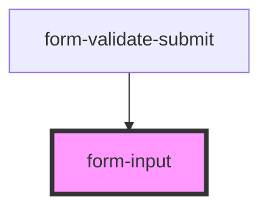

# form-input

<!-- Auto Generated Below -->

## Properties

| Property         | Attribute        | Description | Type                                 | Default      |
| ---------------- | ---------------- | ----------- | ------------------------------------ | ------------ |
| `cssClassString` | `class-string`   |             | `string \| string[]`                 | `''`         |
| `input`          | `input`          |             | `any`                                | `undefined`  |
| `labelPosition`  | `label-position` |             | `"fixed" \| "floating" \| "stacked"` | `'floating'` |
| `lines`          | `lines`          |             | `"full" \| "inset" \| "none"`        | `'inset'`    |

## Events

| Event               | Description | Type               |
| ------------------- | ----------- | ------------------ |
| `form-input-change` |             | `CustomEvent<any>` |

## Dependencies

### Used by

 - [form-validate-submit](../form-validate-submit)

### Graph

----------------------------------------------

*Built with [StencilJS](https://stenciljs.com/)*
