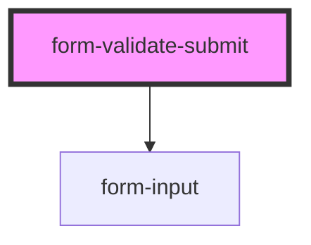

# form-validate-submit

<!-- Auto Generated Below -->

## Properties

| Property        | Attribute        | Description | Type                                 | Default      |
| --------------- | ---------------- | ----------- | ------------------------------------ | ------------ |
| `formJSON`      | `form-json`      |             | `string`                             | `'{}'`       |
| `labelPosition` | `label-position` |             | `"fixed" \| "floating" \| "stacked"` | `'floating'` |
| `lines`         | `lines`          |             | `"full" \| "inset" \| "none"`        | `'inset'`    |

## Events

| Event          | Description                                 | Type               |
| -------------- | ------------------------------------------- | ------------------ |
| `ssapp-action` | Through this event action requests are made | `CustomEvent<any>` |

## Methods

### `submit(name?: string) => Promise<boolean>`

#### Returns

Type: `Promise<boolean>`

## Dependencies

### Depends on

- [form-input](../form-input)

### Graph

----------------------------------------------

*Built with [StencilJS](https://stenciljs.com/)*
